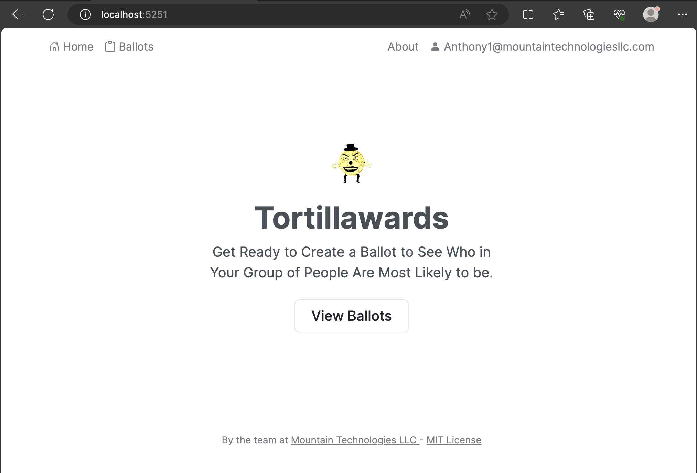
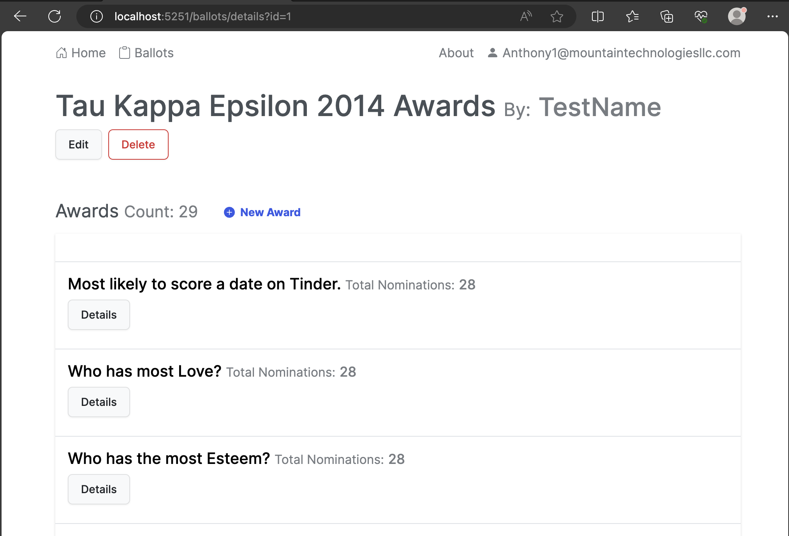

# Tortillawards

## Requirements
.NET 8 Blazor
SQL Server or MySql (with some setup)
Entity Framework Core tools reference - .NET Core CLI

## Setup
Data/Migrations may need to be removed/initialized
- Remove migrations in Data/Migrations
- Run ```dotnet ef database add Initial -o Data/Migrations```
- Run ```dotnet ef database update```

You may need to add permissions to the connection string.

## Running the App
Every logged in user will have access to one Ballot. You should not need to have an email server.



